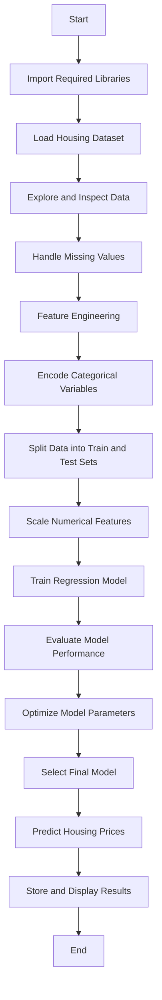

# Housing Price Prediction Project

This project implements an end-to-end Machine Learning pipeline to predict housing
prices using structured tabular data. The complete workflow is developed inside
the `Housing.ipynb` notebook, covering data preprocessing, analysis, model training,
evaluation, and prediction.

---

## Project Objectives
- Perform exploratory data analysis on housing data
- Clean and preprocess raw datasets
- Build regression-based machine learning models
- Evaluate models using standard performance metrics
- Predict house prices for unseen data

---

## Technologies Used
- Python
- Jupyter Notebook
- NumPy
- Pandas
- Matplotlib and Seaborn
- Scikit-learn

---

## Project Structure
- `Housing.ipynb` : Main notebook containing the full ML workflow
- `data/` : Folder containing housing dataset files
- `README.md` : Project documentation

---

## How to Run the Project
1. Clone the repository to your local machine
2. Install the required Python libraries
3. Open `Housing.ipynb` in Jupyter Notebook
4. Execute the notebook cells sequentially

---

## Control Flow of Housing.ipynb

## Machine Learning Approach
  -Supervised learning using regression techniques

  -Evaluation metrics include R² score and RMSE

  -Emphasis on a clean and reproducible pipeline

## Future Improvements
  -Incorporate advanced models such as Random Forest or XGBoost

  -Add cross-validation for better generalization

  -Deploy the model using a web framework

##Author
  -Ashish Kumar Singh

## License
  -This project is intended for academic and educational purposes.
